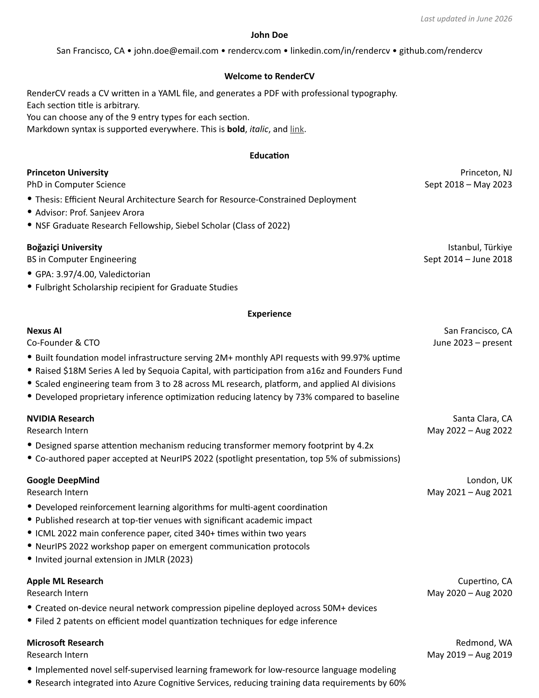
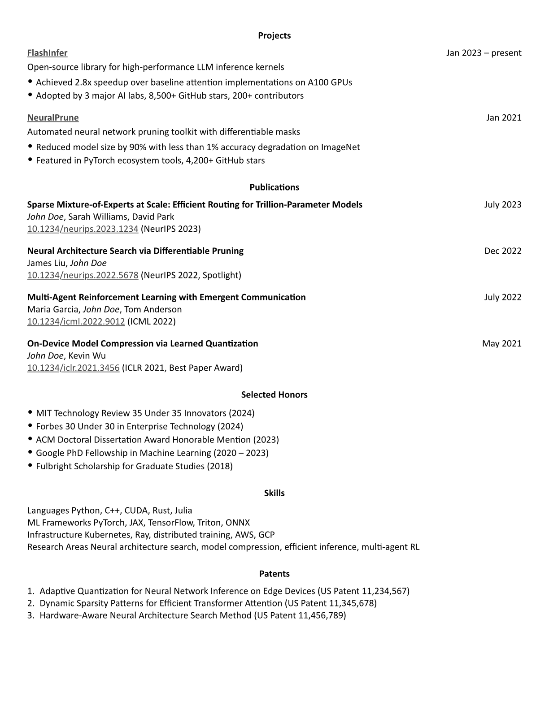

> Simple Curriculum Vitae agentic AI automation with git versioning

## Requirements

- [just](https://github.com/casey/just#installation)
- [uv](https://github.com/astral-sh/uv#installation)

## How to use

#### 1. [Create a fork of this repository](https://github.com/caiostoduto/cv-template/fork) and [change its visibility to private](https://docs.github.com/en/repositories/managing-your-repositorys-settings-and-features/managing-repository-settings/setting-repository-visibility#changing-a-repositorys-visibility)

#### 2. Fork the repository

```sh
$ git clone ...
```

#### 3. Install all dependencies and prepare the project

```sh
$ just install
```

#### 4. Make changes to `rendercv/cv.yaml`

You should probably start by making changes manually editing the `rendercv/*yaml` files, mainly `cv.yaml` and `locale.yaml` (check section '[Understanding the project](#understanding-the-project-detailed)' for optional detailed instructions).

Afterwards, you can ask an **agentic AI** (e.g.: [Claude Code](https://claude.com/product/claude-code), [Cursor](https://cursor.com/), [GitHub Copilot](https://github.com/features/copilot), [Google AntiGravity](https://antigravity.google/), [OpenAI Codex](https://openai.com/codex/), [OpenCode](https://opencode.ai/)) to do automatic changes. This repository provides a great prompt as a guide for doing those changes (check '[PROMPT.md](/PROMPT.md)'), and don't forget to replace the required fields.

> ✨ Suggestion: Put all your experience at `rendercv/cv.yaml` and let agentic take things out and complement what's already there

#### 5. Generate and render the rendercv file

```sh
$ just generate # or 'just watch' (requires watchexec)
```

#### 6. Check the generated PDF (repeat step 2 as many times as you need!)

#### 7. Add the changes to your private repo (optionally)

```sh
$ just git-add `branch_name` # I recommend giving it a name like "company-job_title-language-YYYY-MM-DD"
$ git commit -m "..."
$ git push
```

## Understanding the project (detailed)

WIP

## Results

### Preview

[](output/John_Doe_CV.pdf)
[](output/John_Doe_CV.pdf)
[](output/John_Doe_CV.pdf)

### Considerations

